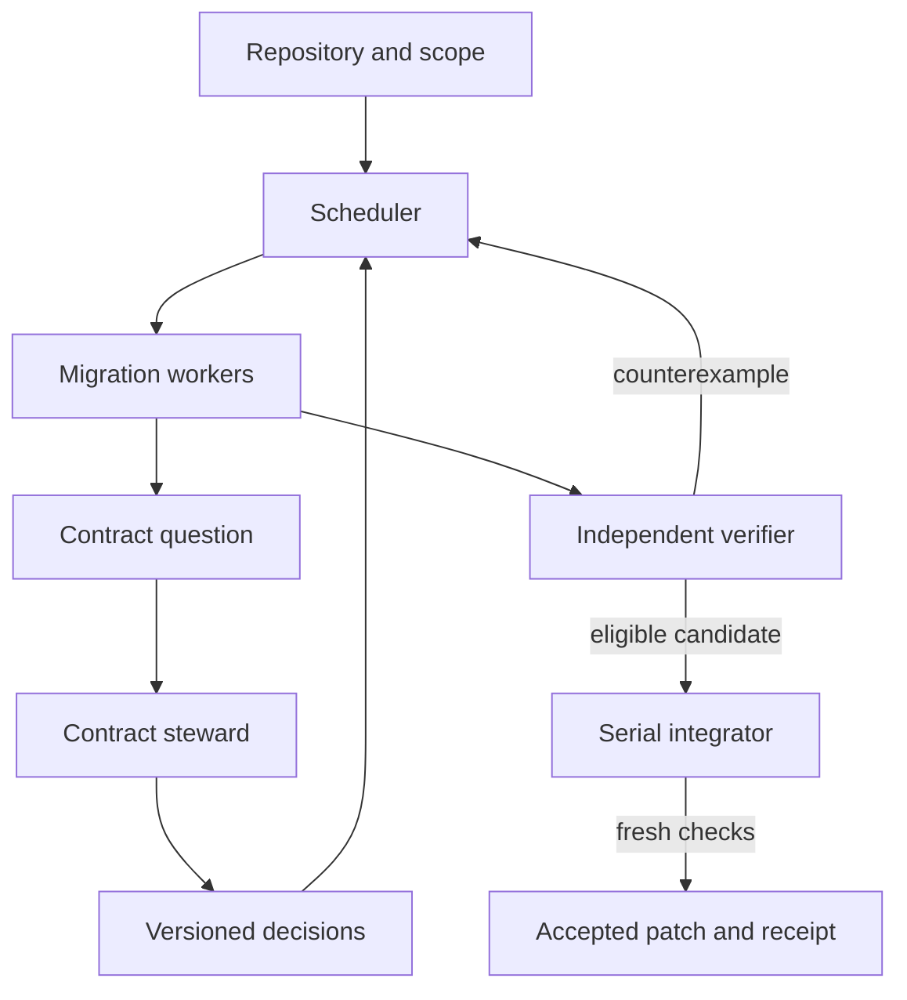

# Ratchet — verified migration, one safe step at a time

**Hack the North 2026 · Huawei openJiuwen Multi-Agent Challenge · Warp Best Developer Tool**  
**Plan date:** September 19, 2026  
**Build assumption:** three people, 36 elapsed hours; 54 planned focused person-hours plus 12 contingency person-hours  
**Required routes:** Python → Rust; C → Rust; TypeScript → ArkTS  
**Scope:** a few explicitly supported modules per route, with executable verification and useful partial output.

> **One line:** Ratchet coordinates agents to migrate bounded pieces of software across languages, catches behavioral changes with an independent verifier, and carries discovered compatibility decisions to every affected worker.

> **Pitch:** Moving code to a new language is easy to demonstrate and difficult to trust. Ratchet gives developers three focused migration routes: Python data-processing loops to Rust, C buffer utilities to safe Rust, and TypeScript business logic to ArkTS. Specialist agents migrate small modules while a shared contract records the behavior they must preserve. An independent runner compares the old and new implementations, rejects bad patches, and feeds concrete counterexamples back to the team. The developer receives working migrated modules, reproducible verification evidence, and a clear list of unsupported code.

## 1. The recommendation

Build **one migration workbench with three small adapters**, rather than three broad translators. Make Python the deeper, live collaboration example. Make C and ArkTS complete but smaller demonstrations of the same workflow. All three are required for the full planned deliverable; only their depth differs.

**Three-person delivery decision:** keep Python's two independent functions plus their composition, migrate one public C decoder with a private checksum helper, and migrate one public TypeScript view-model function with private validation into one ArkTS module. Ship a CLI and generated report. Use reviewed manifests, one Python single-agent comparison pair, and real correctness checks on every route. No separate frontend, automatic codebase partitioner, optional Skill package, or new infrastructure belongs in this build. Three human owners share the work; the software still uses two migration agents and an on-demand contract steward.

The strongest moment is a precise failure: “This translation changes the bucket for a negative timestamp. Ratchet caught it, repaired the translation, and gave the dependent task the corrected guidance before integration.” Follow that with an inspectable patch and actual execution results.

The product's useful unit is a **verified module with a declared compatibility boundary**. Its progress metric is accepted functionality, not source lines deleted. Its distinctive feature is the connection between **behavioral evidence, shared decisions, and dependent work**.

This plan improves prize alignment; it cannot guarantee a win or guarantee an implementation before its toolchains are tested. Outstanding dependencies have owners, deadlines, and explicit fallback behavior below. No benchmark result, successful port, or installed dependency is asserted by this planning document.

**Reading guide:** [scope](#5-scope-contract-three-required-profiles), [Python](#6-python--rust-exact-deliverable), [C](#7-c--rust-exact-deliverable), [ArkTS](#8-typescript--arkts-exact-deliverable), [architecture](#9-architecture-and-meaningful-agent-collaboration), [verifier](#11-the-verifier-checks-independence-and-limits), [evaluation](#16-fair-evaluation-what-the-team-actually-adds), [schedule](#19-delivery-plan-for-three-people-and-36-hours), [audit](#24-plan-audit-and-remaining-readiness-risks).

### What changes from the original brief

| Original idea | Revised decision | Reason |
|---|---|---|
| Port a 3–5k-line Python library | Approximately 280–480 source lines across three small fixtures; hard ceiling 520 | Keep three complete routes within three people's capacity |
| A referee agents cannot fool | Independent, restricted verifier with a stated threat model | Tests and isolation provide evidence, not infallibility |
| Show a worker cheating | Show a behavioral mismatch; label injected faults explicitly | A repeatable demonstration should not misrepresent a scripted event |
| Hub modules go first | Freeze shared interfaces first; execute dependency leaves before callers | High graph degree does not determine valid execution order |
| No `unsafe` anywhere | No application `unsafe` in Rust cores; allow the fixed PyO3 bridge and trusted dependencies | Python bindings and safe Rust cores have different boundaries |
| No performance regression on every route | Correctness gates on all routes; performance measurements on Python | C → Rust and TS → ArkTS have other primary benefits |
| Same coverage percentage across languages | Exact test inventory plus shared behavioral cases and integration execution | Python and Rust coverage percentages are not directly comparable |
| Self-improving codemods in the main demo | Versioned shared decisions and targeted revalidation | Useful adaptation without building a second synthesis system |
| A second host, a cold reviewer, worker kill, cost curve | Defer until after the hackathon | Preserve verification, native execution, and presentation time |
| Dedicated UI and referee lanes | CLI/report only; engine owner implements gate, route owners supply cases and cross-check it | Every task has one of three actual human owners |
| Comparison runs for every route | One fair paired Python comparison; correctness evidence on all three | Measure collaboration without a large evaluation campaign |
| Universal package/library support | Explicit function, type, API, and dependency allowlists | Unsupported code must be visible before execution |

## 2. Track strategy and evidence

The attached Huawei brief is the authority for the rubric below. It explicitly values small, complete collaboration and does not require a large agent count or a Swarm Skill. Its framework language is inconsistent: some sections allow another framework, while submission-format bullets name JiuwenSwarm/WorkSwarm. **Use WorkSwarm/SwarmFlow on the happy path.** If that integration fails, ask the organizers about the alternative before claiming Huawei eligibility. The [linked challenge issue](https://github.com/openJiuwen-ai/jiuwenswarm/issues/3067) was not retrievable during this review; the supplied attachment was read in full.

| Huawei criterion | Weight | What judges should actually see |
|---|---:|---|
| Multi-agent collaboration | 30% | Two workers, one contract question, an evidence-backed answer, dependent work updated, independent acceptance |
| Scenario value and creativity | 25% | A developer modernizes useful code while preserving behavior and retaining control over unsupported cases |
| Demo completeness | 20% | Input repository → migration → real compiler/runtime → accepted patch and report |
| Technical implementation | 15% | Bounded execution, isolated candidates, serial integration, checkpoints, explicit failure states |
| Reusability and extensibility | 10% | The same workflow and receipt format run through all three route adapters |

The Warp criteria supplied by the user require no Warp API. Optimize for the developer's experience: a clear preview, useful errors, a reviewable patch, and one command to reproduce the evidence. Use Warp while developing if convenient; an Oz integration is outside the critical path.

| Warp criterion | Product decision |
|---|---|
| Developer experience | One scope manifest, a preview before model spend, inspectable failures, easy partial adoption |
| Wow factor | A plausible translation passes compilation but is rejected for a concrete semantic error |
| Technical difficulty | Cross-language execution, shared-contract coordination, and fresh integration checks |
| Originality | One workflow couples counterexamples to affected workers across three bounded migration routes |
| Design | A readable terminal and one compact evidence view; no decorative agent network |

ArkTS is relevant to the Huawei ecosystem, but the supplied rubric awards no separate ArkTS bonus. It earns its place by demonstrating the reuse of the collaboration workflow, not through branding alone.

## 3. Existing work and the defensible innovation

Do not present automated language migration, differential testing, safe C-to-Rust translation, or dependency ordering as new inventions.

| Existing work | What already exists | Ratchet's positioning |
|---|---|---|
| [C2Rust](https://github.com/immunant/c2rust) | C translation, subsequent refactoring, and current LLM-assisted postprocessing and validation | A broader developer workflow with explicit compatibility contracts and common evidence across migration routes |
| [Syzygy](https://arxiv.org/abs/2412.14234) | LLM-assisted C-to-safe-Rust translation with code/test generation and dynamic analysis | Do not claim the first verified safe-Rust migration |
| [SACTOR](https://arxiv.org/abs/2503.12511) | C-to-Rust translation with static analysis and FFI-based verification | Keep incremental migration and verification claims specific to this implementation |
| [ArkAdapter, ISSTA 2025](https://conf.researchr.org/details/issta-2025/issta-2025-papers/63/Porting-Software-Libraries-to-OpenHarmony-Transitioning-from-TypeScript-or-JavaScrip) | Automated project-level JS/TS adaptation to ArkTS using LLMs | TS → ArkTS itself is not the novelty |

**The innovation to implement:** a migration decision has consequences that the system tracks. When evidence clarifies a shared contract, Ratchet versions that decision, identifies which chunks relied on it, rejects stale results, and issues new evidence only after the affected chunks are checked again. The user can see *why* a result became stale and *what* was retested.

This is a defensible product distinction, not a claim of research priority. Ordinary agents could implement similar processes. Ratchet makes the process explicit, repeatable, and visible without the developer manually coordinating it.

There are three essential mechanisms:

1. **Compatibility contracts:** accepted input domain, observable outputs, errors, ordering, mutation, and dependencies.
2. **Counterexample-driven coordination:** a failing input or worker question becomes a shared decision, with references to source behavior and affected chunks.
3. **Evidence receipts:** machine-readable records binding accepted code to its source, contracts, verifier, toolchain, and actual results.

Receipts are reproducibility records. They are not mathematical proofs, security certifications, or evidence of all-input equivalence.

## 4. The user and the complete scenario

**User:** a developer moving portable business logic to another runtime while keeping a working application.

**Demo repository:** `telemetry-workbench`, a small, openly labeled, purpose-built fixture containing three independent legacy components:

- A Python batch-processing module that deduplicates sensor records and computes time-window summaries.
- A C byte-buffer decoder for a small telemetry frame format, including its private checksum helper.
- A TypeScript module that validates and presents typed telemetry summaries, to be migrated to ArkTS.

The scenario is coherent, but **the three components are independently executable**. There is no Rust-to-ArkTS native bridge, live device connection, backend deployment, or cross-language distributed application to build. A local demonstration can pass fixed sample data between their outputs without making that integration a new product requirement.

Clearly label the repository “demo fixture created for this project.” Do not imply it is a migrated production system. Freeze source implementations, tests, contracts, and evaluation cases before worker runs. Retain commit history and the frozen baseline hash.

The full user journey is:

1. Run `ratchet doctor` to inspect framework, compilers, isolation, and ArkTS device/runtime availability.
2. Run `ratchet scan --profile py-rust-batch --repo ./telemetry-workbench` to validate the checked-in scope manifest and display included exports, declared dependencies, exclusions, and limits.
3. Review that scope and start the bounded migration. Automatic discovery of arbitrary repository boundaries is outside this build.
4. Watch workers ask and resolve compatibility questions; inspect a failing input if a candidate is rejected.
5. Receive an accepted local branch, patch, report, and reproduction command.
6. Repeat using `c-rust-buffer` and `ts-arkts-core` with the same interface and evidence format.

These are **proposed Ratchet commands to implement**, not existing WorkSwarm commands. The tool never needs to open an upstream PR automatically. A local branch and patch are sufficient for the demo.

## 5. Scope contract: three required profiles

| Profile | Useful migration unit | Primary value | Mandatory demo depth | Target source size |
|---|---|---|---|---:|
| `py-rust-batch` | Typed, deterministic batch transforms over bounded records | Reduce Python-loop overhead while retaining the Python-facing API | Two independent chunks and one dependent composition chunk | 150–240 LOC |
| `c-rust-buffer` | Stateless byte-buffer decoding with an internal checksum helper | Replace manual indexing with a safe Rust core | One public function, one accepted chunk | 70–120 LOC |
| `ts-arkts-core` | Fixed-schema validation and presentation logic | Make portable application logic usable in a pinned ArkTS project | One public function in one migrated module, actual SDK compilation and execution | 60–120 LOC |

Sizes exclude fixed scaffolding, fixtures, and tests. They are ceilings for workload planning, not goals to pad toward. Prefer fewer complete functions. A route is not “supported” merely because an agent can generate plausible files.

### What support means

| Status | Meaning |
|---|---|
| `UNSUPPORTED` | Scan found features outside the profile; no automatic migration promise |
| `PLANNED` | Scope is accepted, but no target has been validated |
| `GENERATED` | Candidate files exist |
| `COMPILED` | The real target compiler accepted the candidate |
| `BEHAVIOR_CHECKED` | The required target runtime executed the declared behavioral suite successfully |
| `ACCEPTED` | Fresh integration checks passed on the exact accepted repository tree |
| `BLOCKED` | A toolchain, semantic, budget, or verification requirement could not be satisfied |

The demo must aim for `ACCEPTED` on all three routes. If the ArkTS runtime is unavailable, display `COMPILED` or `BLOCKED` honestly and acknowledge that the full three-route goal was not achieved. Do not lower the definition of acceptance to hide that limitation.

### Applicable language/library surface

| Route | Include first | Why this is valuable | Explicitly exclude |
|---|---|---|---|
| Python → Rust | `list`, `tuple`, `dict`, bounded integers, loops, comparisons, stable sorting, small pure helper functions; selected `collections` patterns only when normalized to these types | Common application-side ETL and aggregation code; easy to exercise through one batched boundary | NumPy, pandas, PyTorch, SciPy, Django/FastAPI applications, ORM behavior, async, reflection, monkey-patching, generators, arbitrary user classes |
| C → Rust | `stdint.h` values, pointer-plus-length read-only buffers, explicit byte shifts, small structs, loops, error enums, fixed bounds | Embedded/protocol utilities are a natural boundary for safe slices and explicit errors | Whole libc, POSIX services, drivers, inline assembly, unions, bitfields, variadics, callbacks, threads, volatile/MMIO, complex ownership, general malloc/free graph conversion |
| TS → ArkTS | Declared records/classes, arrays, loops, concrete return types, supported basic string/number operations, fixed-field null handling | Portable domain models, data validation, view-model preparation | React/Next.js UI, DOM/browser APIs, Node APIs, Express, arbitrary npm packages, decorators/framework conversion, unrestricted structural typing, reflection, dynamic property access, complicated type-level programming |

These are applicability choices, not claims that these are the most downloaded libraries. Large numerical Python libraries often already execute native kernels; migrating their APIs wholesale is both difficult and a weak default performance story. Use `Vec`, `HashMap`/`BTreeMap`, and ordinary Rust iteration internally. Add no Polars, ndarray, rayon, networking crate, or application framework in the MVP.

The scanner validates explicit manifests, file existence, named exports, declared dependencies, and a short denylist. Human route owners review the small source fixtures before freezing them. No new parser integration, AST extraction, or automatic interprocedural analysis is required. Report unfamiliar code as “requires review”; a manifest check does not establish general language support.

## 6. Python → Rust: exact deliverable

### Fixture and chunk boundaries

Use `Record = tuple[str, int, int, int]` in the order `(sensor_id, timestamp_ms, sequence, value_milli)`, and accept a list of these tuples. No mutable user-defined classes cross the boundary.

| Chunk | Function | Required semantics | Dependencies |
|---|---|---|---|
| P1 | `dedupe_latest(records)` | For each sensor/timestamp key, greatest sequence wins; equal sequence uses the last input occurrence; deterministic sorted output | Record contract |
| P2 | `window_stats(records, width_ms)` | Bucket timestamps using mathematical floor division; count, sum, minimum, maximum per sensor/bucket; deterministic sorted output | Record and bucket contracts |
| P3 | `summarize(records, width_ms)` | Deduplicate first, then summarize; preserve the frozen Python API and error behavior | P1 and P2 |

P1 and P2 may run concurrently. P3 waits for their accepted interfaces and implementations. The shared contract is prepared before scheduling; shared contract questions can still arise about implementation choices or missing edge-case documentation.

P1 returns a fresh `list[Record]`, sorted by `(sensor_id, timestamp_ms)`. P2 returns a fresh list of `(sensor_id, bucket_start_ms, count, sum_milli, min_milli, max_milli)`, sorted by `(sensor_id, bucket_start_ms)`, where `bucket_start_ms = floor(timestamp_ms / width_ms) * width_ms`. It aggregates every input record, including duplicates. P3 returns P2's shape after applying P1. None mutates the input. Strings sort by ASCII byte/code-point order, which agrees within the declared identifier domain.

**Domain:** at most 10,000 records per call; `sensor_id` is a nonempty ASCII identifier of at most 32 characters; timestamp is an integer in ±10^12 milliseconds; sequence is 0 through 2^31−1; value is an integer in ±10^9 milli-units; window width is 1 through 86,400,000 milliseconds. These bounds keep sums in signed 64-bit range. Exclude booleans from integer fields explicitly. Empty input returns an empty output.

The frozen Python facade validates this domain for both the original and migrated implementations. Use `TypeError` for incorrect container/field types and `ValueError` for out-of-range values, with frozen error codes in the exception arguments. Check the outer container/count first, width for P2/P3 second, then records in input order and fields in tuple order; the first failure wins. Do not compare interpreter-generated diagnostic wording. Boundary validation is part of the predeclared source API, not a way to narrow the task after seeing failures.

### Runtime structure

- A Rust core crate owns business logic and uses `#![forbid(unsafe_code)]`.
- A small, fixed PyO3 binding crate adapts the Python data representation to the core. Workers cannot modify its loading rules or use it to call Python business logic.
- A Python facade routes each accepted chunk to the extension. Pending chunks retain their original Python implementation. The original source is also preserved in a separate oracle snapshot.
- P3's fully migrated path invokes the Rust P1/P2 implementations. When the final acceptance run disables the legacy implementation, the facade must still complete the exported supported scenario.
- Export switching is generated by the integrator from the accepted manifest and audited as part of the diff. It is not arbitrary worker-authored loader code.

[Maturin's mixed-project layout](https://www.maturin.rs/project_layout) supports a Python package alongside a Rust extension. Use a pinned, minimal template. PyO3's own [performance guidance](https://pyo3.rs/main/performance.html) highlights conversion and boundary costs; measure a batch API rather than thousands of tiny Python-to-Rust calls.

### Python acceptance

Run the immutable public API suite against the hybrid package, and run cross-language cases through the original oracle and the real extension. Assert module loading paths. Re-run accepted P1 and P2 when P3 integrates. A fixed adversarial smoke check must prove that a Python fallback cannot satisfy the accepted target path.

Test empty input, negative timestamps, bucket boundaries, duplicate records, equal-sequence ties, order permutations, repeated keys, maximal values, invalid widths, booleans, and malformed records. Include `timestamp_ms=-1, width_ms=1000`: the quotient is −1 and the returned bucket start is −1000, not 0. Use exact integer comparison.

Permutation invariance applies to P1 only when each duplicate key has a unique greatest sequence. Equal-sequence ties intentionally depend on input order, so permutation tests for those cases compare against the correspondingly permuted source output rather than assuming invariance.

Measure release-mode performance on one fixed 10,000-record batch with conversion costs included. Warm both implementations; use at least seven timed repetitions and report median and range. Additional 100/1,000-record measurements are the first evaluation detail to cut if time is tight; the single representative batch is sufficient. Record hardware, input seed, build flags, and runtime versions. Report a slowdown if one occurs. Performance is informational in this build and cannot override correctness acceptance.

## 7. C → Rust: exact deliverable

Use a small frame decoder created for the demo. One public decoding function and its private helper form one chunk. There is no encoder migration or standalone checksum export in the three-person build.

### Frame format

| Bytes | Meaning |
|---|---|
| 0 | Fixed magic byte `0xA7` |
| 1 | Format version `1` |
| 2–3 | Payload length as unsigned 16-bit little-endian |
| 4 through 4+length−1 | Payload bytes, maximum length 256 |
| Final byte | Sum of all preceding frame bytes modulo 256 |

Total length must equal `5 + payload_length`; trailing bytes are invalid. The checksum is a simple integrity field for this fixture, not a cryptographic mechanism.

Migrate public `decode_frame` and its private `checksum8` helper together. Decode returns the payload on success or one error from a frozen priority order: `TRUNCATED_HEADER` (fewer than 4 bytes), `BAD_MAGIC`, `BAD_VERSION`, `LENGTH_LIMIT`, `LENGTH_MISMATCH`, `BAD_CHECKSUM`. The source C implementation must implement the same order. Empty payload is valid; zero-byte input is not a frame.

Private `checksum8` accepts a byte slice of length 0–261 and returns an unsigned value 0–255; empty input returns 0. `decode_frame` accepts allocated byte slices of length 0–512 and applies the error priority above. The trusted C adapter owns output buffers of fixed sufficient capacity, passes valid pointer/length pairs, and serializes only initialized outputs. Null pointers, insufficient output capacity, and allocation failure are outside this migration API. Decode errors return no partial payload.

Accumulate the checksum in an unsigned 32-bit value before reducing modulo 256, or use explicitly equivalent wrapping arithmetic. Normalize payloads and frames as arrays of integers 0–255. A small frozen test-data generator creates valid frames for the oracle and target; it is trusted harness code, not a migrated encoder or an additional supported API.

### Ownership and API decision

The source C wrapper provides valid buffers with explicit lengths and normalizes results into records for the runner. The target Rust API uses slices and owned output, such as `decode_frame(&[u8]) -> Result<Vec<u8>, FrameError>`. The core uses `#![forbid(unsafe_code)]`.

**This is a source/API migration of an isolated library utility, not a drop-in C ABI replacement.** Ratchet emits the old-to-new signature mapping and a working Rust caller. Preserving a C caller through an `extern "C"` bridge is optional later work; it adds pointer validity and ownership obligations that are unnecessary for this hackathon demo.

The runner tests C and Rust as separate executables. Compile the frozen C oracle with address and undefined-behavior sanitizers during fixture qualification. Do not execute arbitrary invalid pointers. Malformed *bytes inside valid buffers* are legitimate inputs. A sanitizer finding disqualifies that oracle case from equivalence claims and blocks fixture qualification until the source behavior is defined; it is never silently discarded from the report. Compiler/sanitizer flags are pinned in the fixture manifest. See [Clang AddressSanitizer](https://clang.llvm.org/docs/AddressSanitizer.html) and [UndefinedBehaviorSanitizer](https://clang.llvm.org/docs/UndefinedBehaviorSanitizer.html).

### C acceptance

Compare exact decoded payload bytes and status/error code. Test zero-length payload, 256-byte payload, every truncation position of representative frames, invalid lengths, high-bit bytes, incorrect checksum, extra trailing bytes, and invalid header/version combinations. Valid frames from the frozen generator must decode to their known payloads in both implementations. No encoder or round-trip migration requirement is added.

Rust acceptance means the selected application core compiles with the unsafe-code prohibition and matches the tested source behavior. It does not certify the entire dependency tree, absence of logic bugs, freedom from panics on every possible input, or memory safety of the original C program. The original C implementation must not be linked into or invoked by the accepted target.

## 8. TypeScript → ArkTS: exact deliverable

### Pin the actual target before writing the adapter

“ArkTS” must refer to a specific installed SDK and application dialect. Record the DevEco Studio version, HarmonyOS/OpenHarmony SDK distribution, API level, build tooling, runtime/device image, and test framework. Do not mix a standalone experimental static compiler, an OpenHarmony compiler checkout, and a HarmonyOS app SDK under one compatibility claim.

**Preferred route:** a team laptop with official DevEco Studio, a working SDK, and a local emulator or physical device. Create a tiny test application once. Replace only its generated `.ets` business-logic modules. Use the build command generated and validated for that exact project and run native tests through the available ArkTS test tooling. Do not invent a universal Hvigor command that might not match the installed release.

The official OpenHarmony documentation explains [TS-to-ArkTS adaptation rules](https://github.com/openharmony/docs/blob/master/en/application-dev/quick-start/typescript-to-arkts-migration-guide.md). Use the pinned SDK's diagnostics as the final language authority; rules and supported APIs must be confirmed against that version.

Require strict ArkTS validation with no diagnostic downgrade or suppression. The official [migration background](https://github.com/openharmony/docs/blob/master/en/application-dev/quick-start/arkts-migration-background.md) documents different enforcement below compatibility API 10; use `compatibleSdkVersion >= 10` where applicable, or the pinned current SDK's equivalent strict configuration. Verify enforcement with the deliberately invalid h2 sample. Save the relevant version's migration rules locally rather than depending on live documentation access during the demo.

### Fixture

Migrate one `telemetry-view-model` source module into one `.ets` module. Its only public business function is `makeViewRows`; `validateReadings` is a private helper migrated in the same chunk. Named data types belong to that module. Keep validation, threshold classification, and stable presentation sorting, with no UI or network calls.

Freeze this API before agents run:

| Element | Exact observable contract |
|---|---|
| `Reading` | Fields `sensorId: string`, `sequence: number`, `valueMilli?: number`; sequence is an integer 0–2^31−1; ID matches `[A-Za-z0-9_-]{1,32}` |
| Private `validateReadings(readings, threshold)` | Returns a fixed `ValidationResult` with `ok`, `errorCode`, and `errorIndex`; success is `(true, "OK", -1)`; tested through the public function, not as a separate export |
| Validation order | Invalid integer/range threshold → `BAD_THRESHOLD`; more than 1,000 records → `TOO_MANY`; then first record in input order failing ID, sequence, or present value → `BAD_ID`, `BAD_SEQUENCE`, or `BAD_VALUE` with its index; non-record errors use index −1 |
| `makeViewRows(readings, threshold)` | Calls validation; on failure returns `{ok:false,errorCode,errorIndex,rows:[]}`; on success returns the same fields with `ok:true`, `"OK"`, −1, and rows |
| `ViewRow` | Fields `sensorId`, `sequence`, `present:boolean`, `valueMilli:number`, `status:string`; every field always exists in normalized output |
| Optional values | Absent and explicitly `undefined` values both mean missing; missing yields `present:false`, `valueMilli:0`, `status:"missing"`; real zero yields `present:true` |
| Classification | Present value greater than or equal to threshold → `"alert"`; otherwise `"normal"` |
| Ordering and duplicates | Sort by sensor ID ascending, then sequence ascending, then original input index; retain duplicates and ties |
| Purity and empty input | The public function and its private helper do not mutate inputs; empty valid input produces an empty successful row list |

Source structural types become named target classes as required by the pinned compiler, without changing these normalized records. The supported invalid-input tests use typed records with invalid values or bounds. Arbitrary wrong-shaped JavaScript objects and wrong primitive types are outside this profile; the trusted case adapter rejects them before execution.

Include at least one legitimate source construct that requires adaptation under the pinned SDK, such as simple destructuring or an inline object-type declaration. Record that the original logic, transplanted unchanged into the `.ets` template, fails the corresponding ArkTS check, while the transformed logic compiles and executes. Verify the restriction during preflight; if the installed dialect accepts it, select another documented incompatibility before freezing the fixture. A file-extension rename of already-compatible code is not a convincing migration demonstration. Do not enlarge the fixture to collect more syntax examples.

| Source pattern | Bounded transformation | Verification requirement |
|---|---|---|
| Fixed-shape object literals and interfaces | Explicit target types/classes and initialized fields where required | The real ArkTS compiler accepts the generated modules |
| Optional numeric measurement | Explicit presence check with a declared fallback/status | Missing and zero remain distinguishable |
| Array filter/map/reduce or loops over declared records | Supported ArkTS operations or equivalent explicit loops | Order, ties, empty input, and results match |
| Repeated fixed-field validation | Explicit typed validation without reflective access | Invalid records have the same declared result |
| Declared finite status strings | A concrete target status representation supported by the pinned SDK | Public normalized output is preserved |

Use a predeclared typed source API. Avoid an arbitrary `any`-shaped JSON boundary in the MVP. The trusted input adapter supplies typed records to both runners; JSON parsing inside the migrated module is outside scope. The serializer must encode field presence explicitly when needed, because ordinary JSON serialization can erase `undefined`.

**Domain:** at most 1,000 records; ASCII identifiers; finite integer measurements and thresholds within ±10^9; explicit optional numeric fields; stable error/status strings. Exclude NaN, infinities, negative zero, dates/timezones, prototype behavior, getters/setters, arbitrary unions and generics, dynamic keys, and mutation-dependent behavior. Every exclusion is visible in the manifest.

### Mandatory native verification

1. Run the original TypeScript logic with the pinned Node/TypeScript source setup.
2. Build the generated `.ets` with the actual target SDK.
3. Execute the target methods in the actual target runtime, using a small generated native test module and batched deterministic vectors.
4. Export or collect machine-readable case IDs and observations through the test runner or a tagged local result channel. Validate the expected run nonce, completion marker, case set, and result count.
5. Compare source and target observations in the trusted host verifier.

Expected outputs and acceptance decisions stay with the trusted verifier. A test transport may carry inputs into the target, but output printed by the application does not itself constitute a pass. Missing records, duplicate IDs, exceptions, and timeout are failures.

**Hour-2 gate:** execute one passing and one deliberately failing target assertion, compile one known-invalid ArkTS construct and observe rejection, and run one valid fixture function on the device/emulator. This proves the SDK and runtime are real participants in the loop.

If the source logic also happens to run after `.ets` is copied to `.ts`, that is an auxiliary debugging check. `tsc`, Node, lint rules, renamed extensions, and syntax-only checks do not establish ArkTS runtime compatibility.

### Output and scope limitation

Deliver the generated `.ets` module, the tiny buildable example/test project, a signature mapping, the pinned target identity, and actual test logs. The output is portable logic for that project. It is not a complete HarmonyOS app migration, general npm compatibility layer, React-to-ArkUI converter, or evidence of compatibility with every ArkTS version.

If no valid native runtime is available by h2, immediately record an ArkTS delivery risk and time-box setup recovery to h4. Use the same supported setup with a minimal native smoke function, not a new compiler ecosystem. If runtime access remains unavailable at h4, stop open-ended setup, produce a compile-only artifact with a visible status, and redirect effort to the working workflow. This preserves an honest submission but does not fulfill the full three-route acceptance goal. Even with a working runtime, cap ArkTS-specific implementation at eight focused hours before shrinking the fixture to the explicitly reduced fallback in Section 20.

## 9. Architecture and meaningful agent collaboration

Use three active model roles at most: two migration workers and one contract steward, invoked only when needed. They may use the same model. Separate responsibilities, permissions, and context matter more than different model names.

These are software roles, not extra teammates. Human owners A, B, and C are assigned in Section 19; none of the model roles replaces the scheduled human work of toolchain setup, oracle review, integration, or recording the submission.

| Component | LLM? | Responsibility | Cannot do |
|---|---|---|---|
| Manifest validator and planner | No | Check the reviewed manifest and construct its declared dependency graph | Discover arbitrary source-level dependencies |
| Scheduler | No | Dispatch ready work, enforce budgets, checkpoint state, route messages | Change expected behavior to obtain a pass |
| Worker A / Worker B | Yes | Propose a migration patch, ask questions, repair using counterexamples | Edit harness, source oracle, policy, contracts, or other workers' files |
| Contract steward | Yes | Investigate a shared question using source and allowed probes; propose a documented decision | Override failed tests or rewrite the source oracle |
| Contract service | No | Validate proposals, version decisions, notify affected workers | Accept unsupported new semantics automatically |
| Verifier | No | Build and execute independently; compare observations; produce verdicts | Trust a worker's claimed results |
| Integrator | No | Apply allowlisted patches serially and verify the resulting tree | Merge a stale, failed, or unverified candidate |
| Evidence view | No | Render persisted events and receipts | Invent activity or green statuses |



### The collaboration that must be visible

A P2 worker asks how to implement the already-frozen floor-division rule in Rust for signed timestamps and positive widths. The steward inspects the source, runs a permitted source probe, and proposes a target implementation such as `div_euclid` for the positive-width domain. The contract service records that implementation guidance. P1 continues unaffected; dependent P3 receives the latest guidance when it is dispatched. The verifier checks P2 and the composed P3 independently.

If a candidate was produced using older relevant guidance, it becomes stale. A candidate that already implements the correct rule may only need revalidation; another may need repair. Demonstrate stale-result rejection with a labeled injected stale receipt if no natural stale result occurs. Do not claim that P1 changed because of a bucketing rule it never uses. The source behavior stays frozen; the agent collaboration resolves its target representation.

Do not force every question through an LLM. Known contract values are returned directly. Invoke the steward for a new representation question, conflicting interpretations, or a failure affecting more than one chunk. If the intended behavior is genuinely ambiguous, block the chunk with one precise human question; continue independent work.

### SwarmFlow implementation boundary

The official [SwarmFlow guide](https://github.com/openJiuwen-ai/jiuwenswarm/blob/develop/docs/en/TUISwarmFlowGuide.md) documents deterministic Python workflows, structured agent results, parallel execution, worktree isolation, and token budgets. It also documents important constraints: parallel failures may appear as `None`, and a budget-exhausted run cannot simply resume. The guide describes the development branch, not necessarily the team's installed version.

Use a checked-in workflow script and a narrow framework adapter. Pin the actual working version. Test two worker calls, one structured result, one failed call, and one tool invocation by h2. Keep Ratchet state outside the framework so a new workflow invocation can resume completed work. Inspect every worker result explicitly.

The original brief reports an installed WorkSwarm 0.2.6 setup and Rust 1.94; these were not available for inspection here. Treat them as team-reported status until `doctor` verifies them. The [current WorkSwarm installation page](https://openjiuwen.com/en/workswarm) uses updated command names, so retain the existing activation script only after checking it against the installed package. Do not repeat an unverified claim that autonomous mode has particular open bugs.

Document the exact integration in the submission: what runs inside WorkSwarm, how workers are spawned, how messages/results return, and which deterministic services Ratchet supplies. A framework logo or an unused installation is not an integration.

## 10. Partitioning, shared decisions, and stale work

### Manifest-based partitioning

1. Start from allowlisted exports and files in a reviewed route manifest.
2. Read dependencies explicitly declared by the route owner. Check referenced files and exports; do not build automatic import/call extraction.
3. Have the route owner review the frozen fixture for undeclared dependencies and dynamic behavior. Unknown code is unsupported until reviewed.
4. Detect cycles in the tiny manifest graph. Reject cyclic manifests for this build; manually group a cycle into one bounded chunk before the run if necessary. No general cycle-splitting implementation is required.
5. Freeze shared interface definitions before dispatching workers.
6. Schedule dependency-ready chunks, respecting disjoint write paths and at most two concurrent workers.
7. Integrate dependencies before callers. Shared-file edits are centralized in the integrator's fixed templates.

The explicit manifest is the shipped planning mechanism. P1 and P2 are independent; P3 depends on both. The C decoder and private checksum are one chunk; the ArkTS public function and private validation are another. There are five migration chunks across the three routes. Only the Python route needs parallel migration workers; secondary routes reuse the worker, steward, and gate as needed.

### Contract contents

Every contract states its identifier and version, input/output shapes, numeric bounds, error conditions, order/tie behavior, mutation policy, imported dependencies, and source evidence. Decisions distinguish:

- **Existing behavior:** frozen before the run and preserved by the migration.
- **Implementation clarification:** a target representation consistent with existing behavior; the steward may propose this.
- **Behavior change:** different externally visible behavior; out of scope for automatic acceptance.

A failed test must never be “fixed” by editing its expected value to match the candidate. If the original behavior was underspecified, a clarification must be supported by the source and probes, and the input domain must remain unchanged. Conflicting requirements produce `BLOCKED`.

The contract service versions implementation guidance only. Frozen input domains, observable semantics, normalization rules, case generators, and comparator policies remain outside its write authority. Schema and evidence-reference checks cannot establish the truth of arbitrary natural-language rulings; independent source/target execution remains the acceptance test. A proposed guidance change that contradicts frozen semantics is rejected, not incorporated into a revised oracle.

### Minimal invalidation mechanism

Maintain `chunk → contract IDs` and `chunk → dependency chunk IDs`. On a decision version change, invalidate all direct users and their dependent closure. On a source change, invalidate the changed chunk and dependent closure. These are short graph traversals over fewer than ten chunks, not a new dependency-analysis platform.

A worker result includes the source base and contract hashes it used. If any relevant hash changed, discard its acceptance eligibility even if compilation succeeded. The worker may reuse its code after reading the update and submitting a new candidate. If the affected set is uncertain, revalidate every chunk in that route. Never guess an incomplete affected set.

**Already accepted code:** a contract update immediately marks affected receipts stale and the run non-exportable. Build a new integration candidate and revalidate the affected closure before restoring exportability. Keep the previous accepted snapshot available as an immutable historical artifact. Do not silently label its old receipt valid under a new contract.

## 11. The verifier: checks, independence, and limits

### Trust boundary

Worktrees isolate file edits; they do not isolate processes, secrets, or the verifier. Run candidate builds and executables in a restricted environment controlled by a trusted supervisor. Workers receive mediated tools scoped to their candidate directory. They cannot launch unrestricted host commands.

For Python and C/Rust, use a prebuilt local container environment if available: no network, no secrets, no host socket, dropped privileges, a read-only toolchain/dependency cache, a candidate workspace, a temporary output directory, and CPU/memory/time limits. Build steps can execute code, so isolation applies to compilation too. Do not mount the oracle, hidden case store, ledger database, or verifier code into target execution.

The host supervisor runs the source oracle and target separately, feeds inputs, parses outputs, and decides the verdict. Expected values and locked evaluation cases remain outside worker access. Target programs inevitably see the inputs they are asked to process; do not claim those inputs remain secret during execution.

For ArkTS, the trusted host owns the frozen test project, build configuration, device invocation, case inventory, and comparison. Only allowlisted `.ets` modules come from workers. Record the weaker practical isolation boundary of a local emulator/device rather than implying it is identical to the container setup.

If isolated execution is unavailable, use only the reviewed local fixtures, restrict worker tools, and label the verifier as protecting against accidental test/configuration edits and simple bypass attempts. Do not advertise resistance to a hostile arbitrary repository.

### Ordered gate

| Stage | Requirement | Failure outcome |
|---|---|---|
| 1. Provenance | Candidate's source base, route, relevant contracts, and dependencies match the current run | `STALE` |
| 2. Patch boundary | Only allowlisted files; no path traversal, symlinks escaping the root, unexpected binaries, test/config edits, or hidden generated business logic | `REJECTED_POLICY` |
| 3. Harness integrity | Frozen harness, original source, test inventory, build settings, lockfiles, and runner hashes match | `REJECTED_INTEGRITY` |
| 4. Target build | Actual target compiler passes required settings with no suppressed diagnostics | `REJECTED_BUILD` |
| 5. Target constraints | Rust core unsafe prohibition; no original-code fallback; no new unapproved dependency/build script; ArkTS constraints enforced | `REJECTED_POLICY` |
| 6. Public contract tests | Expected case IDs actually execute; no additional skip/xfail; no missing, duplicate, or fabricated completion | `REJECTED_TEST` |
| 7. Differential cases | Exact declared observations match; crash, timeout, malformed output, and panic count as failures | `REJECTED_BEHAVIOR` |
| 8. Integration | Apply on current accepted head and re-run affected plus end-to-end checks | `REJECTED_INTEGRATION` |
| 9. Receipt | Trusted supervisor records the exact accepted tree and evidence | `ACCEPTED` |

Use per-project lint/diagnostic policy pinned before the run. Do not make every warning in transitive dependencies fatal by accident. The fixed Rust crate root owns `forbid(unsafe_code)`; workers cannot relax it. Ban newly added `todo!()` and `unimplemented!()` and obvious stubs as useful diagnostics, but do not mistake keyword scanning for proof of correctness.

Standalone target execution excludes the original implementation from mounts/link inputs. The intermediate Python hybrid necessarily retains pending legacy functions; its fixed dispatcher must forbid fallback for accepted exports, and each accepted export is also checked in the isolated target path. Final P3 acceptance disables the legacy business logic entirely. Freeze loading and wrapper code and review the small dependency graph and diff. This is stronger than searching for an import string, but still not a formal guarantee against an adversarial program.

### Immutable tests across languages

Preserve original test files and original expected behavior. Python public tests can execute through the unchanged facade. For C and ArkTS, a trusted adapter translates shared case data into the target's test transport; it does not pretend source and target test files are identical. Hash the generator and frozen case manifest, and make the transformation inspectable.

Compare **case identity and outcome**, not just total test count. A suite with the same count can still skip or replace important tests. Track fixture setup failures and compiler failures separately from ordinary assertion failures. “Zero tests ran” is never a pass.

### The verifier's own checks

Before development migration runs at h4–h8, A must show a known-correct target passes, a wrong output fails, and a protected-file edit is rejected, with candidate permissions in place. Development receipts remain provisional. By h16, C completes the full mutation suite below with A/B support; **all checks must pass before the release candidate, comparative evaluation, or final export**:

- Accept a known-correct small target.
- Reject an output stub that returns a constant.
- Reject a changed test or build configuration.
- Reject one missing result and one duplicate case ID.
- Reject a target attempting to use the original implementation.
- Reject a stale contract receipt.
- Reject a labeled negative-division mutation.

These are narrow checks of the product's critical promise. A implements the gate, B contributes the source-fallback and Rust-path cases, and C runs the remaining mutation checks independently of A's implementation. Independence here means separate checks and protected execution, not a fourth human reviewer.

If these checks reveal a verifier defect, fix it and rerun affected candidate acceptance with the new verifier hash. Earlier development passes cannot be promoted to release evidence without that revalidation.

## 12. Test data, counterexamples, and final evaluation

Use three datasets with distinct purposes:

| Dataset | Visible to workers? | Used for repair? | Purpose |
|---|---|---|---|
| Public specification examples and tests | Yes | Yes | Communicate expected behavior |
| Development differential cases | Inputs/failures can be revealed by the verifier | Yes | Find and repair translation errors |
| Locked evaluation cases | No before the evaluated run ends | No in that evaluated run | Measure final behavior without feedback contamination |

Once a case is revealed for repair, it is a development case. It is no longer a held-out result. The locked evaluation snapshot and seed are frozen before comparing the single-agent and team configurations. If a final evaluation fails, retain that failure in the results; a subsequent repair is a new run and must use a newly reserved evaluation set for any new unseen claim.

### Concrete MVP case budgets

| Route | Named development edge cases | Seeded development cases | Locked final cases |
|---|---:|---:|---:|
| Python | At least 30 | 500 bounded batches | 200 batches with separate seeds and boundary compositions |
| C | At least 20, plus truncation positions | 300 valid/corrupted byte buffers | 200 separately generated buffers |
| ArkTS | At least 20 | 100 typed vectors in a native batch | 100 separate vectors |

These are planned counts, not completed results. B owns Python/C case data; C owns ArkTS cases and gate mutation cases; A supplies one shared comparison engine. Reduce generation volume only before a run and record the change; never silently omit timed-out cases. Use small seeded generators, not a new coverage-guided fuzzing system. Larger stress campaigns are deferred beyond the hackathon.

A failing case includes the source observation, target observation, route, chunk, contract hashes, and reproduction command. Retain the complete first failing generated case. Use a small predefined negative-timestamp case for the demo. Automated shrinking is outside this build; a reproducible counterexample is sufficient and avoids another implementation task.

Final locked evaluation failure makes the affected artifact non-exportable as `ACCEPTED` for the evaluated release. Preserve the failure and earlier development evidence. Independent unaffected routes can still be exported with their own receipts.

## 13. Integration, failure recovery, and budgets

### Serial integration

Workers never write the accepted branch. The integrator owns a dedicated local `ratchet/accepted/<run_id>` branch and a single-writer lock.

1. Verify the proposed patch and relevant hashes.
2. Apply it to a temporary integration tree based on the current accepted head.
3. Generate only the known facade/export updates from fixed templates.
4. Build and run required affected and end-to-end checks on this exact tree.
5. Record a pending integration transaction with the tested tree hash and prior head.
6. Commit and update the accepted branch only if its previous head is unchanged.
7. Record the commit, receipt, and successful transaction completion.

If applying a patch conflicts, return the current base and conflict details to the worker; do not ask another unconstrained agent to merge everything. If head changes during checks, rerun on the new tree. A receipt from a worker's old worktree cannot authorize a different integrated tree.

On restart, reconcile a pending transaction against the actual branch head/tree. Complete the record if the expected commit exists; otherwise re-run integration. This prevents a crash between commit and database update from losing or double-applying work.

### State machine and retries

`READY → RUNNING → CANDIDATE → VERIFYING → ACCEPTED` is the successful path. Side states include `WAITING_CONTRACT`, `STALE`, `RETRYABLE_FAILURE`, `BLOCKED`, and `CANCELLED`.

- Give a chunk one initial attempt and at most one repair attempt.
- Apply a default 120-second timeout per model call and at most 240 seconds of proposal/repair work per attempt, including worker tool calls. The aggregate token cap still applies.
- Allow each verifier attempt up to 180 seconds for Python/C or 360 seconds for the pinned ArkTS build/runtime batch. With at most two attempts, use total chunk caps of 14 minutes for Python/C and 20 minutes for ArkTS, including proposal and verification time. These are ceilings, not expected durations; preflight measures warm timings and freezes any changed caps before evaluation.
- On a process/transport failure, record it and retry once within the same two-attempt cap. Use monotonically increasing attempt IDs and reject results from cancelled attempts. Automatic worker reassignment and lease management are deferred; the operator may restart the checked-in workflow from a valid checkpoint.
- Stop launching work near the remaining budget limit. Existing accepted chunks remain usable; never downgrade a failure into a pass to finish the run.
- Persist state after every externally visible transition. On resume, validate source/toolchain/contract hashes before reusing artifacts.

A `BLOCKED` item contains the exact cause, attempted fixes, affected exports, and the next concrete action. Example: “ArkTS native runtime unavailable; SDK build succeeded; execute test batch on the pinned emulator before acceptance.”

### Cost policy

Use one capable tool-calling model for all roles initially. Select it from the credentials actually available; do not rely on an unverified “Fable” endpoint or assume a second model is necessary. Record the provider's exact model ID/revision and usage. If billed token categories are unavailable, mark cost estimates as estimates.

The attachment offers up to $40 in sponsored credits, subject to conditions. Team size does not increase that ceiling. Plan nominal allocations of $6 for integration experiments, $14 for migration/debugging, $8 for evaluation, and $12 reserve. Stop below the actual available credit ceiling. Confirm prices in the team's provider console and derive token caps from them; this document does not assert current model pricing.

Set initial aggregate caps of 30,000 model tokens for the three-chunk Python route and 12,000 each for the single-chunk C and ArkTS routes. Include input, output, repeated context, framework model calls, steward, and repairs; record additional provider-billed token categories if applicable. Calibrate after preflight. The required Python comparison pair has a 60,000-token ceiling; one release candidate generation for each secondary route adds 24,000, totaling 84,000 for those four executions. Development experiments consume a separate measured allowance. Monetary limits take precedence. The single-agent and team arms of the Python comparison use identical caps.

Reuse warm dependency/build caches and save candidate patches, events, receipts, and a backup recording. Do not implement a model-response cache service. Saved patches may be replayed through the current gate with a visible replay label; they do not count as a fresh agent trial or a low-cost new migration. Run the paired comparison without generated-answer reuse.

## 14. Data contracts and adapter interface

Agree on these schemas in hour one. Use versioned JSON with validation at every process boundary. The examples below are illustrative records with placeholder hashes, not measured evidence.

### Common event envelope

```json
{
  "schema_version": 1,
  "run_id": "demo-001",
  "event_id": "demo-001:000042",
  "sequence": 42,
  "timestamp": "2026-09-19T12:00:00Z",
  "type": "candidate.rejected",
  "profile": "py-rust-batch",
  "chunk_id": "P2",
  "attempt_id": "P2:1",
  "actor": "verifier",
  "payload": {
    "reason": "BEHAVIOR_MISMATCH",
    "case_id": "negative-boundary-01",
    "artifact_ref": "cases/negative-boundary-01.json"
  }
}
```

The supervisor supplies event sequence and actor identity. Worker messages are untrusted payloads, never authoritative gate events. Redact credentials and restrict artifact references to the run directory. Render code and messages as text, not executable HTML.

### Chunk manifest

```json
{
  "schema_version": 1,
  "chunk_id": "P2",
  "profile": "py-rust-batch",
  "source_base": "SOURCE_COMMIT",
  "source_files": ["legacy_python/window_stats.py"],
  "exports": ["window_stats"],
  "write_allowlist": ["target_rust/core/src/window_stats.rs"],
  "depends_on": [],
  "contract_ids": ["record-v1", "bucket-semantics"],
  "limits": {"attempts": 2, "proposal_seconds_per_attempt": 240, "verify_seconds_per_attempt": 180, "wall_seconds": 840},
  "oracle_adapter": "python-records-v1",
  "target_adapter": "pyo3-records-v1"
}
```

### Decision ledger entry

```json
{
  "schema_version": 1,
  "decision_id": "D-003",
  "contract_id": "bucket-semantics",
  "version": 2,
  "supersedes": 1,
  "kind": "implementation_clarification",
  "question": "How should the target compute buckets for negative timestamps?",
  "ruling": "Use mathematical floor division for positive width.",
  "evidence_refs": ["source/window_stats.py", "cases/negative-boundary-01.json"],
  "affected_chunks": ["P2", "P3"],
  "proposed_by": "contract-steward",
  "accepted_by": "contract-service",
  "content_hash": "CONTRACT_HASH"
}
```

Version changes do not permit changes to observable behavior. The accepted-by service checks schema, permitted decision kind, evidence references, domain consistency, and frozen policy. Human resolution is required for a true product decision; the default unattended outcome is `BLOCKED`.

### Gate verdict and receipt

```json
{
  "schema_version": 1,
  "run_id": "demo-001",
  "chunk_id": "P2",
  "attempt_id": "P2:2",
  "status": "ACCEPTED",
  "source_commit": "SOURCE_COMMIT",
  "accepted_commit": "TARGET_COMMIT",
  "accepted_tree": "TREE_HASH",
  "contract_hashes": {"record-v1": "HASH_A", "bucket-semantics": "HASH_B"},
  "verifier_hash": "VERIFIER_HASH",
  "toolchain_lock_hash": "TOOLCHAIN_HASH",
  "build_artifact_hash": "ARTIFACT_HASH",
  "case_manifest_hash": "CASE_SET_HASH",
  "checks": {"build": "PASS", "public": "PASS", "differential": "PASS", "integration": "PASS"},
  "cases": {"expected": 530, "observed": 530, "passed": 530, "skipped": 0},
  "locked_evaluation": "NOT_RUN",
  "logs": ["logs/P2-build.txt", "logs/P2-cases.jsonl"],
  "limitations": ["Finite testing within the declared input domain"]
}
```

Development acceptance and release evaluation are separate fields. Exported release reports must include the locked evaluation result and must not describe `NOT_RUN` as a final unseen-test success. Performance and cost records are optional linked artifacts, with units and measurement methodology.

### Internal adapter operations

Each profile implements `preflight`, `scan`, `scaffold`, `run_source`, `build_target`, `run_target`, `normalize_observation`, and `check_constraints`. The common engine owns contracts, permissions, scheduling, retries, comparison policy, integration, and receipt creation.

Adapters return structured observations: case ID, success/error variant, value, exit status, duration, and captured diagnostics. Normalize only agreed representational differences. Do not sort outputs that the contract requires to be ordered, coerce missing to zero, ignore errors, or drop precision merely to make results match.

## 15. Repository and state layout

Use a small Python orchestration package. Reuse existing CLI/JSON/process libraries; do not build an agent framework. Store authoritative run state in SQLite using the standard library and a single-writer supervisor; mirror committed events to JSONL for the CLI and report. Workers have no write access to either. Keep the schema small: runs, chunks/attempts, decisions, and integration transactions. Avoid an ORM, schema-migration service, Redis, message broker, distributed scheduling, or production backend.

| Path | Contents / owner |
|---|---|
| `ratchet/engine/` | Scheduler, contracts, gate orchestration, integration, state |
| `ratchet/framework/` | Thin verified WorkSwarm adapter |
| `ratchet/profiles/` | Three profile implementations and fixed scaffolds |
| `ratchet/schemas/` | Event, manifest, decision, and verdict schemas |
| `fixtures/telemetry-workbench/` | Frozen source, public cases, scope manifests, licenses |
| `ratchet/prompts/` | Checked-in worker and steward instructions; no separately packaged Skill required |
| `ratchet/cli.py` and report template | Terminal progress, case inspection, and generated Markdown evidence |
| `docs/` | Setup, demo, evaluation method, limitations |
| Runtime directory outside worker mounts | State database, oracle snapshots, locked cases, receipts, candidate workspaces |

Model credentials live only in the orchestrator environment. Do not embed them in prompts, receipts, caches, fixture repositories, screenshots, or exported archives. Log model IDs and cost without secret values.

Pin dependencies and prefetch before demo runs. Avoid upgrades after the end-to-end checkpoint. Original activation scripts and setup notes can be reused once validated; an existing setup is not evidence that every new profile already works.

## 16. Fair evaluation: what the team actually adds

The independent gate helps a single agent too. To evaluate collaboration, give both configurations the same verifier and feedback. Do not compare a carefully equipped team against a deliberately weak one-line prompt.

| Configuration | Implementation |
|---|---|
| Single-agent baseline | One persistent capable agent receives the same scope, initial contracts, source, scaffold, tools, and task decomposition; it performs all chunks and can query the source oracle |
| Ratchet team | Two workers plus an on-demand contract steward, with shared decisions and the same deterministic gate |

Freeze model ID/revision, sampling settings, initial source commit, public/development cases, target scaffolding, tool access, total token cap, wall-time cap, and hardware allocation. Include steward, repair, and orchestration model calls in team usage. Both use the same allowed target compilers and the same feedback policy. The single agent can propose implementation guidance through the same contract service; it performs the steward responsibility in its own context. Record concurrency; it is an intentional treatment difference. Cap aggregate CPU/memory so extra resources do not masquerade as coordination gains. Set full-route caps of 45 minutes for Python and 20 minutes for each secondary route. The Python comparison uses the same cap in both arms; the aggregate token cap can stop either arm earlier. These are hard ceilings and do not guarantee every possible retry will fit.

Run **one paired Python comparison**, with at most 90 minutes of execution across its two arms. It exercises the actual two-worker dependency scenario. C and ArkTS still receive full route-specific correctness and locked evaluation checks, but no single-agent comparison is required for them. Label their comparative results “not evaluated”; do not infer a measured team advantage on those routes. Repeated trials and secondary-route comparisons are deferred. Record run order and cache policy, warm build caches consistently, separate setup time, and do not reuse generated migration answers in either comparison arm.

### Results to record

| Metric | Definition |
|---|---|
| Accepted obligations | Number of declared exported behaviors accepted / total scoped behaviors |
| Locked evaluation failures | Mismatches, crashes, timeouts, and missing cases on the untouched final set |
| Policy violations | Unauthorized edits or forbidden dependencies/fallbacks attempted; distinguish attempts from accepted violations |
| Cross-module integration failures | Failures that appear only after composing migrated chunks |
| Time to first accepted chunk | From migration start, with setup reported separately |
| Total wall time | Through final acceptance/evaluation or the frozen timeout |
| Model usage and cost | Aggregate across all model roles, including retries; actual versus estimated labeled |
| Manual interventions | What the human changed and how long it took |
| Final route status | Accepted, partially accepted, compiled only, blocked, or timed out |

Use a blank results template until measured. Never include invented speedups or fill expected winners into the table. For incomplete runs report the cap and completion fraction. A small sample supports a case study, not a universal claim that multi-agent systems outperform single agents.

Use the required labeled stale-result rejection check to demonstrate the ledger's mechanism. A separate no-ledger ablation experiment is deferred. Keep the single paired comparison modestly described as a case study; one pair cannot establish general superiority.

### Distinguish three experiments

1. **Migration quality:** real agent outputs evaluated equally.
2. **Verifier reliability:** labeled mutations of known artifacts, such as a bad division or changed test, must be rejected.
3. **Application performance:** original Python versus accepted Rust-backed Python, measured independently of agent speed.

Do not count injected faults as naturally occurring agent misconduct. Do not count the Rust program's runtime speedup as the agents' development speedup.

## 17. Developer experience and screen design

Ship a CLI and generated Markdown report. There is no web frontend, dashboard server, account system, or hosted UI in the three-person build. Use the existing WorkSwarm terminal where helpful and add only concise Ratchet status, case-inspection, and report commands. The CLI is sufficient for Warp's stated judging criteria.

### Before a run

Show the chosen route, included exports, excluded features with reasons, actual toolchain status, target API compatibility level, and resource limits. For example: “C buffer utility → Rust API; C ABI preservation not included.” The user should not discover that limitation after generation.

### During a run

Use three areas at most:

- **Progress:** chunk status, assigned role, elapsed time, budget, and dependency readiness.
- **Decision:** the latest question, evidence, ruling, and affected chunks.
- **Evidence:** the selected counterexample or receipt, compiler/runtime identity, and reproduction command.

The primary progress counter is “accepted public functions / scoped public functions”: Python 3, C 1, ArkTS 1. Private helpers and target type declarations do not inflate it. Also show `blocked` and `stale` counts. Agent activity is secondary. Use readable terminal tables and text labels; do not implement a custom terminal layout engine. Persist events so rerunning the status command reconstructs state.

### At completion

The report answers four questions immediately: What moved? What was checked? What remains unsupported or blocked? How do I reproduce it?

Export a local branch/patch, `report.md`, `receipts.json`, scope/contract manifests, toolchain identity, and logs. Include a short mapping from original exports to target exports and the test commands. Preserve original source references. The default action is reviewable local output, not an automatic push or merge into a user's main branch.

Do not place internal model prompts, orchestration jargon, or token accounting in the primary flow unless the developer opens details. The user-facing value is a trustworthy, reviewable migration.

## 18. The three-minute demo

Use a live, warm, small migration step and already completed, inspectable run evidence. A three-minute presentation is too short to promise full migrations, three toolchain builds, repairs, benchmarks, and comparisons from cold start. Label recorded execution and saved-patch replay explicitly. A narrates, B operates the CLI and patch view, and C prepares the recording and handles backup evidence; rehearse these assignments together.

| Time | Action | What it proves |
|---|---|---|
| 0:00–0:15 | “A translation can compile and still change what your program does.” Show a tiny negative-timestamp example | Understandable problem |
| 0:15–0:35 | Open the repo's three bounded profiles; select the Python run; show P1/P2 and dependency P3 | Clear scope and task decomposition |
| 0:35–1:10 | Show a real worker question and steward response, or replay a recorded real exchange with its label | Meaningful agent communication |
| 1:10–1:40 | Submit a clearly labeled bad candidate or show an actual recorded rejection; reveal the exact mismatching input | Independent verification |
| 1:40–2:05 | Show the decision version, affected chunks, repair/revalidation, and accepted patch | Adaptive coordination and useful output |
| 2:05–2:35 | Open C and ArkTS receipts; show the safe Rust core check and actual ArkTS runtime identity/results | Three real routes using one workflow |
| 2:35–2:50 | Show the one-pair Python comparison and runtime result, plus correctness-only status for C/ArkTS | Honest technical evidence |
| 2:50–3:00 | Export/open the patch and report: “Move the code. Keep the behavior. Inspect the evidence.” | Developer utility |

Have a shorter 90-second variant: problem, one counterexample, coordinated repair, three receipts, patch. Record a backup video once all routes work. Keep logs and output artifacts locally available if the network fails.

The opening does not need the original unverified statistics about agents cheating. Those particular percentages and denominators were not substantiated in this review. [METR's reward-hacking discussion](https://metr.org/blog/2025-06-05-recent-reward-hacking/) supports a more careful concern about evaluation gaming, but the concrete behavior mismatch is a clearer and more relevant pitch.

## 19. Delivery plan for three people and 36 hours

The team has **three human members**. Budget **18 planned focused hours plus 4 contingency hours per person**, totaling **54 planned + 12 reserve = 66 person-hours**. The remaining elapsed time covers sleep, meals, breaks, event obligations, and handoffs. Do not schedule 108 uninterrupted person-hours or fill the contingency allowance with optional features. AI coding assistance can accelerate a task but does not supply an extra human lane for debugging, toolchain setup, or judging preparation.

### Ownership and effort

| Owner | Sole primary ownership | Required handoff | Planned focus | Contingency |
|---|---|---|---:|---:|
| A | WorkSwarm adapter, shared engine, gate, contracts, state, serial integration, CLI/export command | Schemas and tool interface first; common gate by h4; integrated Python path by h8 | 18 h | 4 h |
| B | Python/Rust and C/Rust profiles, source fixtures, route runners/cases, Python benchmark | Python bridge by h2; C oracle smoke by h4; frozen route observations usable by A | 18 h | 4 h |
| C | ArkTS toolchain/profile, verification mutation cases, evaluation execution, report template/video/submission | Native smoke by h2 or clear blocker; target observations by h8; cross-checks after native path works | 18 h | 4 h |

A owns the common verifier implementation; B and C supply their language-specific runners and case manifests. C owns the small report template and mutation-case data, while A owns exporting the trusted results into that template. There is no separate frontend developer, referee engineer, evaluator, or presentation lane hidden outside this table.

| Owner | Planned work allocation, totaling 18 hours |
|---|---|
| A | Framework/schema integration 3 h; scheduler/contracts/SQLite state 4 h; common gate/serial integrator 6 h; CLI/export 2 h; integration review/setup instructions/rehearsal 3 h |
| B | Python bridge 3 h; Python source/runner/cases 5 h; C decoder/oracle/runner 4 h; shared observation data and Python benchmark 3 h; integration support and reproduction instructions 3 h |
| C | ArkTS SDK/runtime/transport 4 h; one-module fixture/cases 4 h; independent gate mutation checks 3 h; automated Python-pair/locked evaluation execution 3 h; report/video/submission 4 h |

These are workload limits, not guaranteed timings. C's first two allocations cap ArkTS-specific work at eight focused hours. If that is exceeded, apply the reduced fixture or runtime-blocked outcome immediately. Do not take A away from the verifier to build a larger ArkTS integration. If A's shared engine slips, B supplies adapter fixes and C supplies test data; no one starts a replacement engine.

**Handoffs:** each completed component includes its owner, commit, exact command, example observation, known blocker, and next action. Each owner publishes this before a rest period. Use short check-ins at the listed milestones rather than requiring all three people to stay active continuously. Stagger breaks and protect sleep; checkpoints describe artifact readiness, not uninterrupted shifts.

### Milestones and the critical path

| Elapsed time | A: engine and gate | B: Python and C | C: ArkTS and evidence | Exit condition / response |
|---|---|---|---|---|
| h0–h1 | Freeze event/manifest/decision/verdict schemas and tool boundary | Freeze Python and C interfaces | Freeze ArkTS interface and check device access | All owners commit sample JSON; no separate UI work |
| h1–h2 | Two real model-worker calls, structured output, one tool call | Python calls a compiled Rust smoke function; check C compiler availability | Real ArkTS build/run and pass/fail smoke, or documented blocker | Framework/Python/ArkTS feasibility known; C end-to-end preflight is h4 |
| h2–h4 | Gate accepts known-good output and rejects bad output; restricted execution works | Freeze minimal source fixtures; C oracle/sanitizer and Rust runner smoke | Finish native smoke if needed; freeze target build/test template | Stop unresolved native-runtime setup at h4; do not silently mark ArkTS accepted |
| h4–h8 | First Python chunk integrated through framework and gate | Complete Python runner/cases and correct fixed bridge | One-function ArkTS runner emits actual native observations | One end-to-end Python acceptance and native ArkTS observations; use reduced secondary scope if slipping |
| h8–h12 | P1/P2 concurrency, P3 dependency join, steward exchange, stale-result check | Finish Python composition; implement C decoder adapter | Accept ArkTS chunk if feasible; prepare gate mutation inputs | Python collaboration trace works; ArkTS accepted or exact blocker exposed |
| h12–h16 | State/restart reconciliation, CLI/export, core fault checks | C decoder accepted with sanitizer-qualified oracle | Validate common gate with mutation cases; implement report template | Three route candidates accepted; no optional feature work |
| h16–h20 | Fix integration/receipt defects | Fix source/target mismatches; record Python performance | Complete remaining route checks and evaluation script | Full release candidate and reproducible commands; consume contingency only for named blockers |
| h20–h24 | Supervise gate and protect frozen configurations | Support Python paired comparison and benchmark | Run one Python pair and locked cases for all routes; assemble results | Python pair capped at 90 min; C/ArkTS have correctness results, not comparative claims |
| h24–h28 | Fix blocking reproduction issues; finalize README | Independently rerun documented Rust route commands | Finalize report, record backup, rehearse, prepare submission | Feature freeze at h28; artifacts and three-minute story complete |
| h28–h36 | Shared release buffer, rest, final checks and submission | Shared release buffer, rest, final checks and submission | Shared release buffer, rest, final checks and submission | No dependency upgrades, new scope, or extra benchmark campaign |

The critical path is **framework + Python bridge → common gate → Python collaboration/integration → final evidence**. ArkTS setup runs alongside it with an early stop rule. C implementation follows the Python bridge in B's lane; the plan does not require B to build two complete adapters simultaneously. Later blocks can include unattended model/compiler runs and staggered rest, within each person's 22-hour maximum focused allocation.

### Preflight deadlines

| Item | Owner | Deadline | Evidence required |
|---|---|---|---|
| Framework/API and provider | A | h2 | Two structured worker outputs, one tool call, exact model ID and verified credit/pricing settings |
| Python/Rust feasibility | B | h2 | Python imports the extension and receives an observed Rust result |
| ArkTS compiler/runtime | C | h2 target; h4 setup stop | Valid native code runs, invalid target code fails compilation, wrong native assertion is captured |
| C/Rust feasibility | B | h4 | Sanitized C source and Rust smoke target emit comparable observations |
| Common gate and permissions | A | h4 | Known-correct output passes, wrong output fails, protected files/credentials are inaccessible to candidate tools |
| Warm build caches | B/C for their profiles | h4 for source/target smoke builds | Repeat build without dependency downloads |

A preflight smoke target may be a fixed tiny example. It is not claimed as an agent-produced migration; complete acceptance still requires the actual worker, gate, and integrated output.

Verify event rules on pre-existing setup and code with the organizers. Document what existed before the event and what was built during it. Do not assume installed tools or an earlier prototype count as new hackathon work.

## 20. Cut rules and fallback tree

The original Pydantic v1→v2 fallback does not fulfill the revised language scope. Keep it as unrelated prior work; do not silently substitute it for a missing migration route.

**Already removed from the three-person build:** web frontend, automatic codebase graph extraction, C encoder migration, a separate ArkTS validation export, Swarm Skill packaging/publishing, second host/model, rule distillation, automated counterexample shrinking, automatic worker reassignment, response-cache service, secondary-route comparisons, repeated trials, and an external OSS showcase. These are not unassigned tasks waiting for spare time.

**If behind, reduce in this order:** terminal cosmetics; extra Python benchmark input sizes beyond one representative batch; optional source constructs; fixture depth using the explicit reduced profiles below. Keep the one Python comparison pair and correctness gates. If a required outcome still fails, report it as incomplete rather than removing the check or hiding the failure.

**Preserve:** independent gate, actual target execution, WorkSwarm collaboration, explicit implementation decisions, stale-result rejection, truthful statuses, all three route adapters, and inspectable outputs. Fewer supported behaviors are acceptable only with a new clearly labeled scope fixed before the corresponding run; acceptance criteria for retained behaviors do not weaken.

### Explicit reduced secondary fixtures

- **C:** retain `decode_frame`, the exact header/error rules, and the private checksum, but lower the declared payload maximum from 256 to 32 bytes if needed to simplify fixtures. Re-freeze the source, contract, and case manifests before evaluation. Encoding never becomes a requirement. If decoding cannot be verified, mark the route blocked; a checksum-only demo does not silently stand in for it.
- **ArkTS:** replace the batch fixture with one `classifyReading(reading, threshold)` export for a single fixed record. Keep ID/sequence/value validation, missing versus zero, inclusive alert threshold, one genuine TS-to-ArkTS adaptation, and real native execution. Return the same normalized success/error fields with zero or one `ViewRow`; failure has no rows. Input-index errors use index 0, threshold errors −1. This explicitly removes array limits, multi-record sorting, and duplicates from the reduced contract. Record the reduced profile in the scope report; do not claim `makeViewRows` support.
- **Python:** retain P1/P2 and the small P3 composition, with all declared semantics. Reduce generated batch sizes for the live step rather than deleting the dependency scenario. Predeclare any benchmark-size reduction; preserve correctness edge cases.

| Failure | Response | Owner | Claim that remains valid |
|---|---|---|---|
| Engine/gate work exceeds allocation | Stop cosmetic CLI work; keep explicit manifests and fixed templates; use A's contingency for integration defects | A, with B/C adapter fixes | Verified scoped outputs if all mandatory checks pass |
| Rust extension is slow or packaging is troublesome | Keep the single batched boundary; repair the fixed bridge; report actual performance | B | Behavior preservation if the API executes and passes |
| C implementation is late | Apply the explicit reduced decoder contract before the run; stop adding helpers/APIs | B | The declared smaller buffer utility |
| ArkTS module work exceeds eight focused hours | Apply the single-record fallback; keep native runtime and validation requirements | C | The explicitly reduced module on the pinned runtime |
| ArkTS runtime unavailable at h4 | Stop setup, retain genuine compile evidence if available, label runtime verification blocked | C | Compile-only adaptation; the full three-route goal remains unmet |
| Framework API mismatches | Use a pinned working workflow API; ask organizers early if an alternate framework would qualify | A | Huawei integration/eligibility only if substantiated |
| Provider/network failure | Resume checkpointed work or show labeled prior evidence; saved patches still need current checks | A | Reproducible prior result, not a fresh model run |
| Team loses the Python comparison | Keep the measured loss and present evidence/partial-adoption utility | C | Observed workflow value, not general superiority |
| Final case fails | Block that release artifact; retain counterexample and independent successes | A plus route owner | Partial success only |
| Terminal styling or report rendering fails | Show plain status tables, JSON receipts, compiler logs, and the patch | A/C | Complete inspectable developer workflow |

Do not assign extra work to an unnamed helper or assume another teammate will record the demo or run evaluations. C owns those tasks, with protected time after the native adapter is stable; A and B each review the final submission artifacts.

## 21. Expansion after the hackathon

The following are **post-hackathon options**, not stretch goals inside the three-person schedule. All 12 contingency person-hours protect the committed build and submission.

1. **External fixture validation:** migrate selected pure functions from a pinned, attributed project. [TextDistance](https://github.com/life4/textdistance) and [jsmn](https://github.com/zserge/jsmn) remain candidates only after separately defining and qualifying a narrow API; neither is promised as a full-package port.
2. **Broader profiles:** add C encoding/C ABI preservation, a larger ArkTS module, or additional pure Python utilities, each with its own contract and tests.
3. **Additional product/evaluation work:** a web evidence view, reusable Swarm Skill packaging, controlled worker-reassignment demo, repeated comparisons, secondary-route baselines, or a validated deterministic rewrite recipe.

Do not migrate sqlparse or mistune wholesale during this build. The three-person submission succeeds through a complete shared workflow, clear evidence, and limited language profiles.

## 22. Submission checklist and definition of done

### Repository

- [ ] All three bounded fixtures and profile manifests are present, with source provenance and licenses.
- [ ] WorkSwarm/SwarmFlow is genuinely used and its exact pinned integration is documented.
- [ ] Setup includes required compilers, SDK/device requirements, model configuration, dependency locks, and the validated commands.
- [ ] `doctor` reports missing tools clearly; a newcomer can run at least the flagship route from the instructions.
- [ ] Agents' roles, edit permissions, communication, retry policy, and blocked states are explained.
- [ ] Baseline source, public tests, case generators, and verifier version are reproducible.
- [ ] No credentials, hidden local paths, or private API responses appear in exports.

### Functionality

- [ ] Python P1/P2 are migrated with real parallel worker activity and P3 executes the composed result.
- [ ] C's one public decoder and private checksum are migrated together; the core forbids application `unsafe`, runs independently of original C, and passes declared cases.
- [ ] ArkTS's one public function and private validation compile and execute in one module on the recorded real SDK/runtime; the report names any reduced fallback scope.
- [ ] At least one contract question is resolved with source evidence and communicated to another affected agent/task.
- [ ] A stale candidate is rejected and affected work is revalidated.
- [ ] The verifier rejects the known bad patch and unauthorized test/configuration edits.
- [ ] Fresh integration checks authorize only the exact accepted tree.
- [ ] Locked evaluation results appear separately from development tests.
- [ ] The exported report names unsupported cases and limitations.

### Judging assets

- [ ] Three-minute live/recorded script and backup video.
- [ ] One clean screenshot of the counterexample and one of the accepted evidence.
- [ ] One measured Python comparison pair, with losses and incomplete runs retained; C/ArkTS comparative results explicitly marked not evaluated.
- [ ] A measured Python runtime chart/table, or an explicit statement that no speedup was demonstrated.
- [ ] Concise architecture diagram and one paragraph explaining why agents collaborate.
- [ ] Local patch/branch and output artifacts ready to inspect.
- [ ] Working customized WorkSwarm application with checked-in workflow and role prompts; no Skill packaging or second-host claim required.
- [ ] Each deliverable has owner A, B, or C, and the release handoff fits the three-person schedule.

**Definition of the full planned result:** three bounded routes with five public functions in total accepted through real target execution, one meaningful multi-agent coordination sequence, one reliably detected semantic failure, one reviewable output per route, one fair Python comparison pair, and a CLI/report that exposes the evidence. An explicitly reduced secondary profile still needs its own source/contract freeze and real acceptance. Further product features are deferred until after the hackathon.

## 23. Questions judges are likely to ask

| Question | Answer the implementation must support |
|---|---|
| Why not use one coding agent? | One agent is a credible baseline. Ratchet separates implementation and shared-contract reasoning, coordinates independent chunks, and makes evidence/adoption explicit; measured results show whether that helped here. |
| Is the verifier another LLM? | No. It invokes real compilers/runtimes and compares declared observations. The steward is an LLM, but cannot issue a pass. |
| Does this prove equivalence? | No. It supplies reproducible finite testing within an explicit domain and reports exclusions. |
| Can an agent change tests? | Worker edit permissions exclude them; the host checks frozen inputs/configuration and records expected case identities. Worktrees alone would not be sufficient. |
| Is the failure real? | Show the actual run record. If it was injected, say so. |
| Is the C result a drop-in replacement? | The MVP supplies a safe Rust API plus a mapping and runner; C ABI preservation is outside scope. |
| Is ArkTS really running? | Show the pinned SDK, device/emulator identity, artifact hash, native execution logs, and case IDs. |
| What happens to unsupported code? | It stays in place or is listed as blocked. No silently narrowed compatibility claim. |
| Is the telemetry repo a real customer codebase? | It is a disclosed demo fixture with frozen source and evaluation cases. Any external fixture is labeled separately. |
| Is this new? | Existing migration research is acknowledged. The project integrates decisions, propagated counterexamples, evidence, and partial adoption into one reusable workflow. |
| Can the same process handle other libraries? | New adapters/contracts can extend it; only the three declared profiles are implemented and evaluated. |
| What does Huawei's framework actually do? | Identify the actual workflow, model-role execution, tool invocation, and result exchange, then distinguish Ratchet's deterministic services. |

## 24. Plan audit and remaining readiness risks

The plan has been checked against scope, semantic preservation, real target execution, honest evaluation, integration consistency, judging criteria, and the three-person schedule. The audit does not substitute for the h2/h4 preflight and h20 release-candidate checks.

A second independent review covered Rust migration semantics, ArkTS feasibility, and track/evaluation design. It identified and resolved ambiguous output shapes, missing ArkTS function semantics, incompatible timeout limits, hybrid-source isolation wording, and an overstated cross-worker propagation example. The revisions above are incorporated into the executable scope, not left as optional review notes.

The staffing revision rebalanced every task across A/B/C, reduced secondary-route APIs and source size, removed the frontend and extra infrastructure, staggered preflight so B does not build two adapters simultaneously, restricted the comparative evaluation to Python, and reserved 12 contingency person-hours. Human headcount is distinct from the two worker agents and steward retained in the architecture.

| Original gap or risk | Resolution in this plan | Remaining validation |
|---|---|---|
| Three languages could imply universal translation | Three explicit profiles with exclusions and small function sets | Scanner/manifest enforcement |
| Python full-library rewrite too large | Three bounded pure batch functions, fixed bridge | End-to-end import and behavior checks |
| General C pointer/ownership conversion too hard | Bounded buffers; native safe Rust API; no mandatory C ABI | Source oracle sanitizers and Rust core build |
| ArkTS could be faked with TypeScript checks | Real SDK compile and native runtime mandatory | Native smoke at h2; setup stop at h4 |
| “Uncheatable” gate overstated | Restricted execution plus explicitly limited assurance | Positive/negative gate tests |
| Test counts or LOC could be gamed | Case identities, actual backend execution, exact tree receipts | Missing/duplicate/fallback rejection checks |
| Shared decisions could be ignored | Version/hash checks and dependency-closure invalidation | Stale candidate test |
| Contract updates could change intended behavior | Only evidence-backed clarifications; changes block | Fixed domain and source review |
| Parallel edits could merge broken code | Disjoint paths and serialized fresh integration | Conflict and restart reconciliation |
| Hidden tests could become training feedback | Separate development and locked evaluation sets | Reproduction protocol and disclosure |
| C undefined behavior could invalidate the oracle | Sanitized fixture qualification and explicit invalid status | Defined baseline behavior |
| Missing-runtime success could be overstated | Compile/generated statuses are not accepted | CLI/report status correctness |
| Multiple agents could be decorative | Shared question, evidence, notification, and affected revalidation | Real trace visible in demo |
| Claimed novelty overlaps existing research | Prior-art table and narrower product claim | Pitch matches implemented distinction |
| Full demo cannot run cold in three minutes | Warm live step plus labeled recorded evidence | Rehearsal and backup video |
| Framework eligibility text is inconsistent | WorkSwarm happy path; alternate path requires organizer clarification | Actual integration and organizer response if needed |
| Costs/timing may exceed the weekend | Route-specific caps, one Python pair, small secondary fixtures, 54 planned + 12 reserve person-hours | Preflight calibration and owner effort tracking |
| Missing teammate's work could be silently reassigned | Three explicit owners; no frontend lane; C owns evaluation/recording after native setup | Review every deliverable against A/B/C ownership |
| Extra scope could reappear in acceptance checks | C decoder only; ArkTS one public function; no encoder/standalone validation benchmark | Manifests, checklists, and report match the reduced APIs |

**Most important unresolved dependency:** real ArkTS compilation and native execution on available hardware. Resolve it within the early setup limit before enlarging any fixture. **Most important staffing risk:** A's common gate/integrator is the critical path; B and C must deliver structured observations and case data without creating another shared subsystem. **Most important implementation risk:** verification must test the exact exported tree. **Most important judging risk:** overselling breadth, originality, or measured gains that the demo does not support.

## 25. Sources and evidence boundaries

Research was reviewed September 19, 2026. Source links describe existing tools and constraints; the proposed design, fixture sizes, schedule, and acceptance policies are this plan's recommendations.

| Source | Supports |
|---|---|
| User-attached `Pasted markdown(2).md` | Huawei eligibility text, 30/25/20/15/10 rubric, submission expectations, optional Swarm Skill, conditional sponsored credits |
| User-supplied Warp prize text | Developer-experience criteria and no API requirement |
| [WorkSwarm official page](https://openjiuwen.com/en/workswarm) | Current product and installation entry points |
| [Official SwarmFlow guide](https://github.com/openJiuwen-ai/jiuwenswarm/blob/develop/docs/en/TUISwarmFlowGuide.md) | Workflow scripting, worker results, parallel failure behavior, state/budget caveats |
| [Maturin mixed-project layout](https://www.maturin.rs/project_layout) | Python package and Rust extension structure |
| [PyO3 performance guide](https://pyo3.rs/main/performance.html) | Boundary/conversion overhead and performance considerations |
| [C2Rust repository](https://github.com/immunant/c2rust) | Existing translation/refactoring/validation capabilities |
| [Syzygy paper](https://arxiv.org/abs/2412.14234) | Prior C-to-safe-Rust work with LLMs and dynamic analysis |
| [SACTOR paper](https://arxiv.org/abs/2503.12511) | Prior incremental C-to-Rust verification work |
| [ArkAdapter paper entry](https://conf.researchr.org/details/issta-2025/issta-2025-papers/63/Porting-Software-Libraries-to-OpenHarmony-Transitioning-from-TypeScript-or-JavaScrip) | Existing JS/TS-to-ArkTS adaptation research |
| [OpenHarmony migration guide](https://github.com/openharmony/docs/blob/master/en/application-dev/quick-start/typescript-to-arkts-migration-guide.md) | Language adaptation restrictions and recipes; confirm against the pinned SDK |
| [OpenHarmony migration background](https://github.com/openharmony/docs/blob/master/en/application-dev/quick-start/arkts-migration-background.md) | Compatibility-level-dependent diagnostic enforcement |
| [OpenHarmony arkXtest](https://github.com/openharmony/testfwk_arkxtest/blob/master/README_en.md) | Native testing framework capabilities |
| [OpenHarmony compiler frontend](https://github.com/openharmony/arkcompiler_ets_frontend) | Compiler pipelines; JavaScript bytecode generation is not sufficient ArkTS validation |
| [Clang ASan](https://clang.llvm.org/docs/AddressSanitizer.html), [Clang UBSan](https://clang.llvm.org/docs/UndefinedBehaviorSanitizer.html) | Runtime diagnostics for qualifying the C oracle |
| [METR reward-hacking discussion](https://metr.org/blog/2025-06-05-recent-reward-hacking/) | Context for evaluation integrity; not support for the draft's unverified percentages |
| [TextDistance](https://github.com/life4/textdistance), [jsmn](https://github.com/zserge/jsmn) | Post-hackathon external fixture candidates, requiring separate scope qualification |

No source establishes that Ratchet will win, that its gate is infallible, that all three toolchains are installed, or that it outperforms a single agent. Those claims must not appear in the submission without the appropriate evidence, and prize outcomes cannot be guaranteed.
